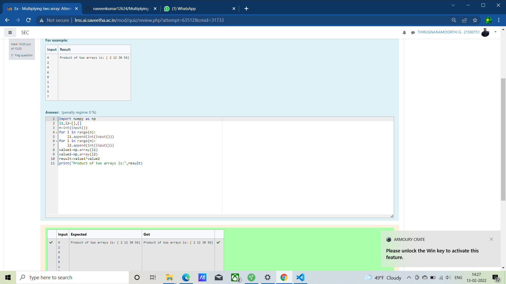

# Multiplying-two-matrix

## AIM: To write apython program to find the multiplying two array matrix

## ALGORITHM:

## Step 1:
import numpy as np

## Step 2:
initially mark l1 and l2 as 0

## Step 3:
mark "n" as input ,then using for loop append the l1 and l2

## Step 4:
create value1 and value2 of array

## Step 5:
create Result = value1 * value 2

## PROGRAM:
~~~
#Developed By : G.Thirugnanamoorthi
import numpy as np
l1,l2=[],[]
n=int(input())
for i in range(n):
    l1.append(int(input()))
for i in range(n):
    l2.append(int(input()))
value1=np.array(l1)
value2=np.array(l2)
result=value1*value2
print("Product of two arrays is:",result)
~~~

## OUTPUT:

## RESULT:
Hence the matrices are multiplied using numpy

